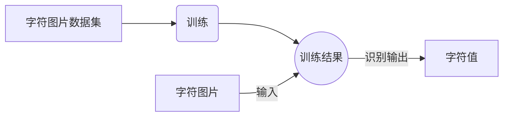
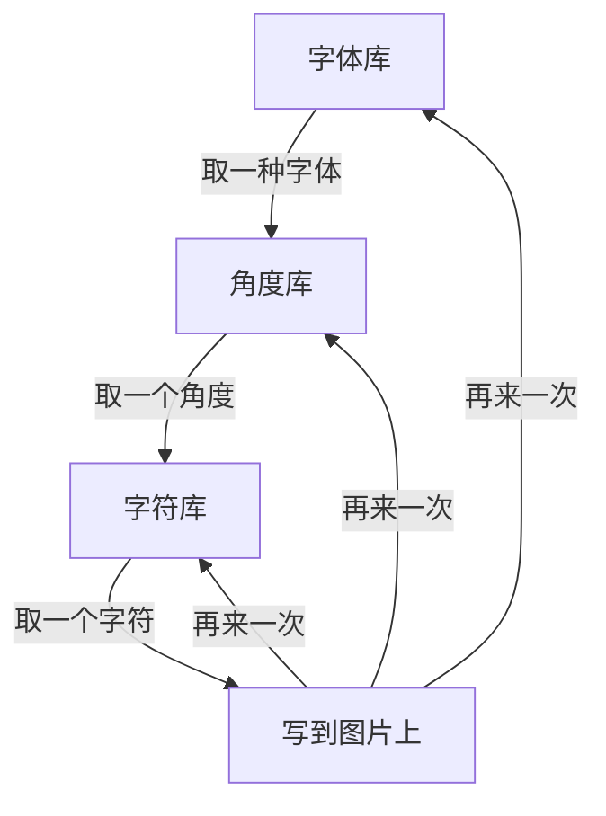
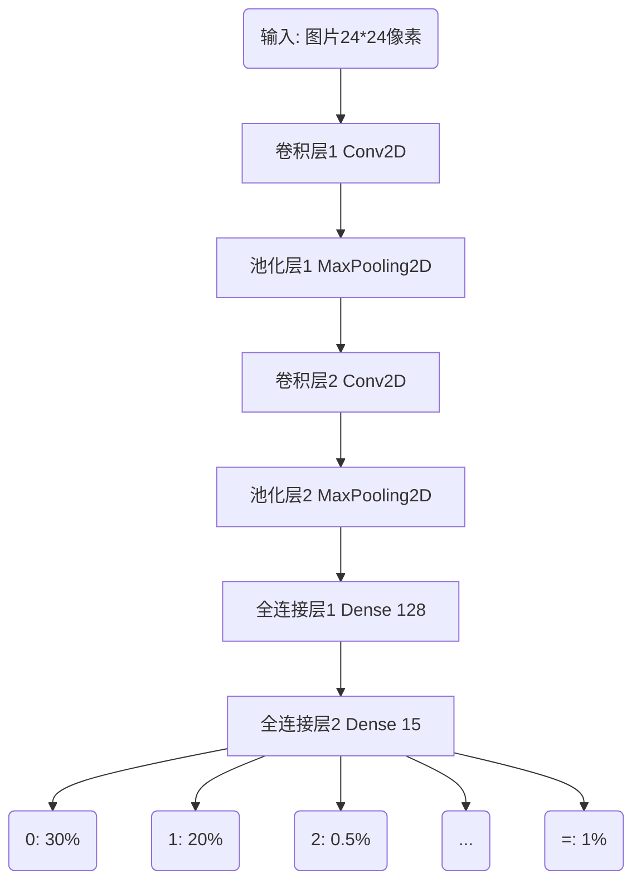
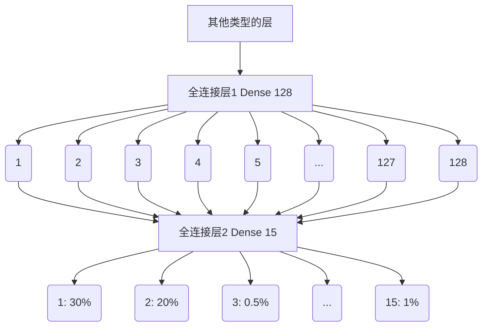
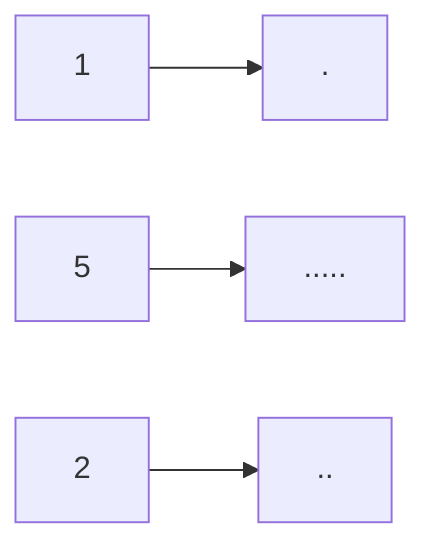
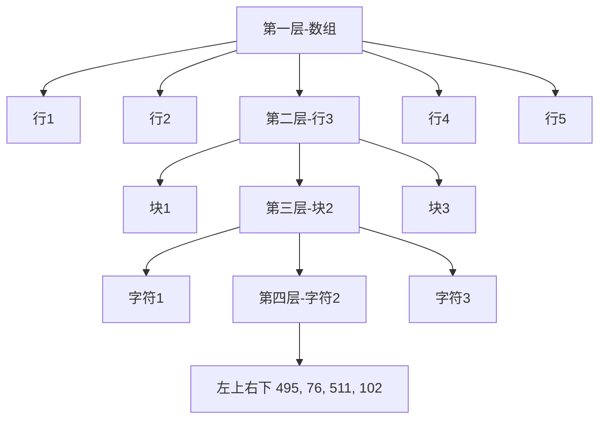

1. fonts文件夹里拷贝一些字体文件，从这里找C:\Windows\Fonts，几十个就行。
2. get_character_pic.py 生成字体
3. cnn.py 训练数据
4. main.py 裁剪指定图片并识别，素材图片在imgs/question.png下，结果文件保存在imgs/result.png。
5. 注意如果识别不成功，很可能是question.png的字体你没有训练（这幅图的字体是方正书宋简体，但是你只训练了楷体），这时候可以使用楷体自己编一个算式图。

# 一、亮出效果
> 最近在线教育行业遭遇一点小波折，一些搜题、智能批改类的功能要下线。

退1024步讲，要不要自己做一个自动批改的功能啊？万一哪天孩子要用呢！

昨晚我做了一个梦，梦见我实现了这个功能，如下图所示：


**功能简介：** *作对了，能打对号；做错了，能打叉号；没做的，能补上答案。*

醒来后，我环顾四周，赶紧再躺下，希望梦还能接上。

# 二、实现步骤

## 基本思路

> 其实，搞定两点就成，第一是能识别数字，第二是能切分数字。

首先得能认识5是5，这是前提条件，其次是能找到5、6、7、8这些数字区域的位置。

前者是**图像识别**，后者是**图像切割**。

- 对于图像识别，一般的套路是下面这样的（CNN卷积神经网络）：



- 对于图像切割，一般的套路是下面的这样（横向纵向投影法）：


既然思路能走得通，那么咱们先搞图像识别。

要自己搞图像识别，得**准备数据**->**训练数据并保存模型**->**使用训练模型预测结果**。


## 2.1 准备数据

> 对于男友，找一个油嘴滑舌的花花公子，不如找一个闷葫芦IT男，亲手把他培养成你期望的样子。

咱们不用什么官方的mnist数据集，因为那是官方的，不是你的，你想要添加+-×÷它也没有。

有些通用的数据集，虽然很强大，很方便，但是一旦放到你的场景中，效果一点也不如你的愿。

只有训练自己手里的数据，然后自己用起来才顺手。更重要的是，我们享受创造的过程。

假设，我们只给口算做识别，那么我们需要的图片数据有如下几类：

```python
索引：0 1 2 3 4 5 6 7 8 9 10 11 12 13 14
字符：0 1 2 3 4 5 6 7 8 9  =  +  -  ×  ÷
```
如果能识别这些，基本上能满足整数的加减乘除运算了。

好了，图片哪里来？！

是啊，图片哪里来？

吓得我差点从梦里醒来，500万都规划好该怎么花了，居然双色球还没有选号！


*梦里，一个老者跟我说，图片要自己生成。我问他如何生成，他呵呵一笑，消失在迷雾中……*


仔细一想，其实也不难，打字我们总会吧，生成数字无非就是用代码把字写在图片上。

字之所以能展示，主要是因为有字体的支撑。

如果你用的是windows系统，那么打开$C:\Windows\Fonts$这个文件夹，你会发现好多字体。


我们写代码调用这些字体，然后把它打印到一张图片上，是不是就有数据了。

而且这些数据完全是由我们控制的，想多就多，想少就少，想数字、字母、汉字、符号都可以，今天你搞出来数字识别，也就相当于你同时拥有了所有识别！想想还有点小激动呢！

看看，这就是打工和创业的区别。你用别人的数据相当于打工，你是不用操心，但是他给你什么你才有什么。自己造数据就相当于创业，虽然前期辛苦，你可以完全自己把握节奏，需要就加上，没用就去掉。

### 2.1.1 准备字体
建一个fonts文件夹，从字体库里拷一部分字体放进来，我这里是拷贝了13种字体文件。


好的，准备工作做好了，肯定很累吧，休息休息休息，一会儿再搞！


### 2.1.2 生成图片

> 代码如下，可以直接运行。

```python
from __future__ import print_function
from PIL import Image
from PIL import ImageFont
from PIL import ImageDraw
import os
import shutil
import time

#%% 要生成的文本
label_dict = {0: '0', 1: '1', 2: '2', 3: '3', 4: '4', 5: '5', 6: '6', 7: '7', 8: '8', 9: '9', 10: '=', 11: '+', 12: '-', 13: '×', 14: '÷'}

# 文本对应的文件夹，给每一个分类建一个文件
for value,char in label_dict.items():
    train_images_dir = "dataset"+"/"+str(value)
    if os.path.isdir(train_images_dir):
        shutil.rmtree(train_images_dir)
    os.makedirs(train_images_dir)

# %% 生成图片
def makeImage(label_dict, font_path, width=24, height=24, rotate = 0):

    # 从字典中取出键值对
    for value,char in label_dict.items():
        # 创建一个黑色背景的图片，大小是24*24
        img = Image.new("RGB", (width, height), "black") 
        draw = ImageDraw.Draw(img)
        # 加载一种字体,字体大小是图片宽度的90%
        font = ImageFont.truetype(font_path, int(width*0.9))
        # 获取字体的宽高
        font_width, font_height = draw.textsize(char, font)
        # 计算字体绘制的x,y坐标，主要是让文字画在图标中心
        x = (width - font_width-font.getoffset(char)[0]) / 2
        y = (height - font_height-font.getoffset(char)[1]) / 2
        # 绘制图片，在那里画，画啥，什么颜色，什么字体
        draw.text((x,y), char, (255, 255, 255), font)
        # 设置图片倾斜角度
        img = img.rotate(rotate)
        # 命名文件保存，命名规则：dataset/编号/img-编号_r-选择角度_时间戳.png
        time_value = int(round(time.time() * 1000))
        img_path = "dataset/{}/img-{}_r-{}_{}.png".format(value,value,rotate,time_value)
        img.save(img_path)
        
# %% 存放字体的路径
font_dir = "./fonts"
for font_name in os.listdir(font_dir):
    # 把每种字体都取出来，每种字体都生成一批图片
    path_font_file = os.path.join(font_dir, font_name)
    # 倾斜角度从-10到10度，每个角度都生成一批图片
    for k in range(-10, 10, 1):	
        # 每个字符都生成图片
        makeImage(label_dict, path_font_file, rotate = k)
```

上面纯代码不到30行，相信大家应该能看懂！~~看不懂不是我的读者。~~

*核心代码就是画文字。*
```
draw.text((x,y), char, (255, 255, 255), font)
```
翻译一下就是：使用某字体在黑底图片的(x,y)位置写白色的char符号。

*核心逻辑就是三层循环。*


如果代码你运行的没有问题，最终会生成如下结果：


好了，数据准备好了。总共15个文件夹，每个文件夹下对应的各种字体各种倾斜角的字符图片3900个（字符15类×字体13种×角度20个），图片的大小是**24×24**像素。

有了**数据**，我们就可以再进行下一步了，下一步是**训练**和**使用**数据。

## 2.2 训练数据
### 2.2.1 构建模型
> 你先看代码，外行感觉好深奥，内行偷偷地笑。
```python
# %% 导入必要的包 
import tensorflow as tf
import numpy as np
from tensorflow.keras import layers
from tensorflow.keras.models import Sequential
import pathlib
import cv2

# %% 构建模型
def create_model():
    model = Sequential([
        layers.experimental.preprocessing.Rescaling(1./255, input_shape=(24, 24, 1)),
        layers.Conv2D(24,3,activation='relu'),
        layers.MaxPooling2D((2,2)),
        layers.Conv2D(64,3, activation='relu'),
        layers.MaxPooling2D((2,2)),
        layers.Flatten(),
        layers.Dense(128, activation='relu'),
        layers.Dense(15)]
    )
    
    model.compile(optimizer='adam',
                loss=tf.keras.losses.SparseCategoricalCrossentropy(from_logits=True),
                metrics=['accuracy'])

    return model
```


*这个模型的序列是下面这样的，作用是输入一个图片数据，经过各个层揉搓，最终预测出这个图片属于哪个分类。*


这么多层都是干什么的，有什么用？和衣服一样，肯定是有用的，内衣、衬衣、毛衣、棉衣各有各的用处。

### 2.2.2 卷积层 Conv2D
> 各个职能部门的调查员，搜集和整理某单位区域内的特定数据。
我们输入的是一个图像，它是由像素组成的，这就是$Rescaling(1./255, input_shape=(24, 24, 1))$中，input_shape输入形状是24*24像素1个通道（彩色是RGB 3个通道）的图像。


卷积层代码中的定义是Conv2D(24,3),意思是用3*3像素的卷积核，去提取24个特征。

我把图转到地图上来，你就能理解了。以我大济南的市中区为例子。


卷积的作用就相当于从地图的某级单位区域中收集多组特定信息。比如以小区为单位去提取住宅数量、车位数量、学校数量、人口数、年收入、学历、年龄等等24个维度的信息。小区相当于卷积核。

提取完成之后是这样的。


第一次卷积之后，我们从市中区得到N个小区的数据。

卷积是可以进行多次的。

比如在小区卷积之后，我们还可在小区的基础上再来一次卷积，在卷积就是街道了。


通过再次以街道为单位卷积小区，我们就从市中区得到了N个街道的数据。

这就是卷积的作用。

通过一次次卷积，就把一张大图，通过特定的方法卷起来，最终留下来的是固定几组有目的数据，以此方便后续的评选决策。这是评选一个区的数据，要是评选济南市，甚至山东省，也是这么卷积。这和现实生活中评选文明城市、经济强省也是一个道理。

### 2.2.3 池化层 MaxPooling2D
> 说白了就是四舍五入。

计算机的计算能力是强大的，比你我快，但也不是不用考虑成本。我们当然希望它越快越好，如果一个方法能省一半的时间，我们肯定愿意用这种方法。

池化层干的就是这个事情。
池化的代码定义是这样的$MaxPooling2D((2,2))$，这里是最大值池化。其中（2,2）是池化层的大小，其实就是在2*2的区域内，我们认为这一片可以合成一个单位。

再以地图举个例子，比如下面的16个格子里的数据，是16个街道的学校数量。


为了进一步提高计算效率，少计算一些数据，我们用2*2的池化层进行池化。


池化的方格是4个街道合成1个，新单位学校数量取成员中学校数量最大（也有取最小，取平均多种池化）的那一个。池化之后，16个格子就变为了4个格子，从而减少了数据。

这就是池化层的作用。

### 2.2.4 全连接层 Dense
> 弱水三千，只取一瓢。

在这里，它其实是一个分类器。

我们构建它时，代码是这样的$Dense(15)$。

它所做的事情，不管你前面是怎么样，有多少维度，到我这里我要强行转化为固定的通道。

比如识别字母a~z，我有500个神经元参与判断，但是最终输出结果就是26个通道(a,b,c,……,y,z)。

我们这里总共有15类字符，所以是15个通道。给定一个输入后，输出为每个分类的概率。



*注意：上面都是二维的输入，比如24×24，但是全连接层是一维的，所以代码中使用了$layers.Flatten()$将二维数据拉平为一维数据([[11,12],[21,22]]->[11,12,21,22])。*


对于总体的模型，调用$model.summary()$打印序列的网络结构如下：
```
_________________________________________________________________
Layer (type)                 Output Shape              Param #   
=================================================================
rescaling_2 (Rescaling)      (None, 24, 24, 1)         0         
_________________________________________________________________
conv2d_4 (Conv2D)            (None, 22, 22, 24)        240       
_________________________________________________________________
max_pooling2d_4 (MaxPooling2 (None, 11, 11, 24)        0         
_________________________________________________________________
conv2d_5 (Conv2D)            (None, 9, 9, 64)          13888     
_________________________________________________________________
max_pooling2d_5 (MaxPooling2 (None, 4, 4, 64)          0         
_________________________________________________________________
flatten_2 (Flatten)          (None, 1024)              0         
_________________________________________________________________
dense_4 (Dense)              (None, 128)               131200    
_________________________________________________________________
dense_5 (Dense)              (None, 15)                1935      
=================================================================
Total params: 147,263
Trainable params: 147,263
Non-trainable params: 0
_________________________________________________________________
```

我们看到`conv2d_5 (Conv2D)            (None, 9, 9, 64) `  经过2*2的池化之后变为`max_pooling2d_5 (MaxPooling2 (None, 4, 4, 64)`。`(None, 4, 4, 64)` 再经过$Flatten$拉成一维之后变为`(None, 1024) `，经过全连接变为`(None, 128)`再一次全连接变为`(None, 15)`，15就是我们的最终分类。这一切都是我们设计的。

$model.compile$就是配置模型的几个参数，这个现阶段记住就可以。


### 2.2.5 训练数据
>执行就完了。

```python
# 统计文件夹下的所有图片数量
data_dir = pathlib.Path('dataset')
# 从文件夹下读取图片，生成数据集
train_ds = tf.keras.preprocessing.image_dataset_from_directory(
    data_dir, # 从哪个文件获取数据
    color_mode="grayscale", # 获取数据的颜色为灰度
    image_size=(24, 24), # 图片的大小尺寸
    batch_size=32 # 多少个图片为一个批次
)
# 数据集的分类，对应dataset文件夹下有多少图片分类
class_names = train_ds.class_names
# 保存数据集分类
np.save("class_name.npy", class_names)
# 数据集缓存处理
AUTOTUNE = tf.data.experimental.AUTOTUNE
train_ds = train_ds.cache().shuffle(1000).prefetch(buffer_size=AUTOTUNE)
# 创建模型
model = create_model()
# 训练模型，epochs=10，所有数据集训练10遍
model.fit(train_ds,epochs=10)
# 保存训练后的权重
model.save_weights('checkpoint/char_checkpoint')
```

*执行之后会输出如下信息：*
```
Found 3900 files belonging to 15 classes. 
Epoch 1/10 122/122 [=========] - 2s 19ms/step - loss: 0.5795 - accuracy: 0.8615 
Epoch 2/10 122/122 [=========] - 2s 18ms/step - loss: 0.0100 - accuracy: 0.9992 
Epoch 3/10 122/122 [=========] - 2s 19ms/step - loss: 0.0027 - accuracy: 1.0000 
Epoch 4/10 122/122 [=========] - 2s 19ms/step - loss: 0.0013 - accuracy: 1.0000 
Epoch 5/10 122/122 [=========] - 2s 20ms/step - loss: 8.4216e-04 - accuracy: 1.0000 
Epoch 6/10 122/122 [=========] - 2s 18ms/step - loss: 5.5273e-04 - accuracy: 1.0000 
Epoch 7/10 122/122 [=========] - 3s 21ms/step - loss: 4.0966e-04 - accuracy: 1.0000 
Epoch 8/10 122/122 [=========] - 2s 20ms/step - loss: 3.0308e-04 - accuracy: 1.0000 
Epoch 9/10 122/122 [=========] - 3s 23ms/step - loss: 2.3446e-04 - accuracy: 1.0000 
Epoch 10/10 122/122 [=========] - 3s 21ms/step - loss: 1.8971e-04 - accuracy: 1.0000
```
我们看到，第3遍时候，准确率达到100%了。
最后结束的时候，我们发现文件夹checkpoint下多了几个文件：
```
char_checkpoint.data-00000-of-00001
char_checkpoint.index
checkpoint
```
上面那几个文件是训练结果，训练保存之后就不用动了。后面可以直接用这些数据进行预测。


### 2.3 预测数据

> 终于到了享受成果的时候了。


```python
# 设置待识别的图片
img1=cv2.imread('img1.png',0) 
img2=cv2.imread('img2.png',0) 
imgs = np.array([img1,img2])
# 构建模型
model = create_model()
# 加载前期训练好的权重
model.load_weights('checkpoint/char_checkpoint')
# 读出图片分类
class_name = np.load('class_name.npy')
# 预测图片，获取预测值
predicts = model.predict(imgs) 
results = [] # 保存结果的数组
for predict in predicts: #遍历每一个预测结果
    index = np.argmax(predict) # 寻找最大值
    result = class_name[index] # 取出字符
    results.append(result)
print(results)
```
我们找两张图片img1.png,img2.png，一张是数字6，一张是数字8，两张图放到代码同级目录下，验证一下识别效果如何。

图片要通过`cv2.imread('img1.png',0)` 转化为二维数组结构，0参数是灰度图片。经过处理后，图片转成的数组是如下所示(24,24)的结构：


我们要同时验证两张图，所以把两张图再组成`imgs`放到一起，`imgs`的结构是`（2,24,24）`。

下面是构建模型，然后加载权重。通过调用`predicts = model.predict(imgs) `将`imgs`传递给模型进行预测得出`predicts`。

`predicts`的结构是`(2,15)`,数值如下面所示：

`[[ 16.134243 -12.10675 -1.1994154 -27.766754 -43.4324 -9.633694 -12.214878 1.6287893 2.562174 3.2222707 13.834648 28.254173 -6.102874 16.76582 7.2586184] 
[ 5.022571 -8.762314 -6.7466817 -23.494259 -30.170597 2.4392672 -14.676962 5.8255725 8.855118 -2.0998626 6.820853 7.6578817 1.5132296 24.4664 2.4192357]] `

意思是有2个预测结果，每一个图片的预测结果有15种可能。

然后根据 `index = np.argmax(predict)` 找出最大可能的索引。

根据索引找到字符的数值结果是['6', '8']。

下面是数据在内存中的监控：


可见，我们的预测是准确的。

下面，我们将要把图片中数字**切割**出来，进行**识别**了。

之前我们准备了数据，训练了数据，并且拿图片进行了识别，识别结果正确。

到目前为止，看来问题不大……没有大问题，有问题也大不了。

下面就是把图片进行切割识别了。

>下面这张大图片，怎么把它搞一搞，搞成单个小数字的图片。


## 2.4 切割图像

上帝说要有光，就有了光。

于是，当光投过来时，物体的背后就有了影。

我们就知道了，有影的地方就有东西，没影的地方是空白。


这就是投影。

这个简单的道理放在图像切割上也很实用。

我们把文字的像素做个投影，这样我们就知道某个区间有没有文字，并且知道这个区间文字是否集中。


下面是示意图：


### 2.4.1 投影大法

>最有效的方法，往往都是用循环实现的。

要计算投影，就得一个像素一个像素地数，查看有几个像素，然后记录下这一行有N个像素点。如此循环。


首先导入包：
```python
import numpy as np
import cv2
from PIL import Image, ImageDraw, ImageFont
import PIL
import matplotlib.pyplot as plt
import os
import shutil
from numpy.core.records import array
from numpy.core.shape_base import block
import time
```

比如说要看垂直方向的投影，代码如下：
```python
# 整幅图片的Y轴投影，传入图片数组，图片经过二值化并反色
def img_y_shadow(img_b):
    ### 计算投影 ###
    (h,w)=img_b.shape
    # 初始化一个跟图像高一样长度的数组，用于记录每一行的黑点个数
    a=[0 for z in range(0,h)]
    # 遍历每一列，记录下这一列包含多少有效像素点
    for i in range(0,h):          
        for j in range(0,w):      
            if img_b[i,j]==255:     
                a[i]+=1  
    return a
```

最终得到是这样的结构：
`[0, 79, 67, 50, 50, 50, 109, 137, 145, 136, 125, 117, 123, 124, 134, 71, 62, 68, 104, 102, 83, 14, 4, 0, 0, 0, 0, 0, 0, 0, 0, 0, ……38, 44, 56, 106, 97, 83, 0, 0, 0, 0, 0, 0, 0]`表示第几行总共有多少个像素点，第1行是0，表示是空白的白纸，第2行有79个像素点。

如果我们想要从视觉呈现出来怎么处理呢？那可以把它立起来拉直画出来。




```python
# 展示图片
def img_show_array(a):
    plt.imshow(a)
    plt.show()
    
# 展示投影图， 输入参数arr是图片的二维数组，direction是x,y轴
def show_shadow(arr, direction = 'x'):

    a_max = max(arr)
    if direction == 'x': # x轴方向的投影
        a_shadow = np.zeros((a_max, len(arr)), dtype=int)
        for i in range(0,len(arr)):
            if arr[i] == 0:
                continue
            for j in range(0, arr[i]):
                a_shadow[j][i] = 255
    elif direction == 'y': # y轴方向的投影
        a_shadow = np.zeros((len(arr),a_max), dtype=int)
        for i in range(0,len(arr)):
            if arr[i] == 0:
                continue
            for j in range(0, arr[i]):
                a_shadow[i][j] = 255

    img_show_array(a_shadow)
```

我们来试验一下效果：

我们将上面的原图片命名为question.jpg放到代码同级目录。
```python
# 读入图片
img_path = 'question.jpg'
img=cv2.imread(img_path,0) 
thresh = 200 
# 二值化并且反色
ret,img_b=cv2.threshold(img,thresh,255,cv2.THRESH_BINARY_INV) 
```
二值化并反色后的变化如下所示：


上面的操作很有作用，通过二值化，过滤掉杂色，通过反色将黑白对调，原来白纸区域都是255，现在黑色都是0，更利于计算。

计算投影并展示的代码：
```python
img_y_shadow_a = img_y_shadow(img_b)
show_shadow(img_y_shadow_a, 'y') # 如果要显示投影
```
下面的图是上面图在Y轴上的投影


从视觉上看，基本上能区分出来哪一行是哪一行。

### 2.4.2 根据投影找区域

>最有效的方法，往往还得用循环来实现。

上面投影那张图，你如何计算哪里到哪里是一行，虽然肉眼可见，但是计算机需要规则和算法。


```python
# 图片获取文字块，传入投影列表，返回标记的数组区域坐标[[左，上，右，下]]
def img2rows(a,w,h):
    
    ### 根据投影切分图块 ### 
    inLine = False # 是否已经开始切分
    start = 0 # 某次切分的起始索引
    mark_boxs = []
    for i in range(0,len(a)):        
        if inLine == False and a[i] > 10:
            inLine = True
            start = i
        # 记录这次选中的区域[左，上，右，下]，上下就是图片，左右是start到当前
        elif i-start >5 and a[i] < 10 and inLine:
            inLine = False
            if i-start > 10:
                top = max(start-1, 0)
                bottom = min(h, i+1)
                box = [0, top, w, bottom]
                mark_boxs.append(box) 
                
    return mark_boxs
```
通过投影，计算哪些区域在一定范围内是连续的，如果连续了很长时间，我们就认为是同一区域，如果断开了很长一段时间，我们就认为是另一个区域。


通过这项操作，我们就可以获得Y轴上某一行的上下两个边界点的坐标，再结合图片宽度，其实我们也就知道了一行图片的四个顶点的坐标了`mark_boxs`存下的是`[坐，上，右，下]`。


如果调用如下代码：
```python
(img_h,img_w)=img.shape
row_mark_boxs = img2rows(img_y_shadow_a,img_w,img_h)
print(row_mark_boxs)
```
我们获取到的是所有识别出来每行图片的坐标，格式是这样的：`[[0, 26, 596, 52], [0, 76, 596, 103], [0, 130, 596, 155], [0, 178, 596, 207], [0, 233, 596, 259], [0, 282, 596, 311], [0, 335, 596, 363], [0, 390, 596, 415]]`

### 2.4.3 根据区域切图片

>最有效的方法，最终也得用循环来实现。这也是计算机体现它强大的地方。


```python
# 裁剪图片,img 图片数组， mark_boxs 区域标记
def cut_img(img, mark_boxs):

    img_items = [] # 存放裁剪好的图片
    for i in range(0,len(mark_boxs)):
        img_org = img.copy()
        box = mark_boxs[i]
        # 裁剪图片
        img_item = img_org[box[1]:box[3], box[0]:box[2]]
        img_items.append(img_item)
    return img_items
```
这一步骤是拿着方框，从大图上用小刀划下小图，核心代码是`img_org[box[1]:box[3], box[0]:box[2]]`图片裁剪，参数是数组的`[上：下，左：右]`，获取的数据还是二维的数组。

如果保存下来：

```python
# 保存图片
def save_imgs(dir_name, imgs):
 
    if os.path.exists(dir_name):
        shutil.rmtree(dir_name) 
    if not os.path.exists(dir_name):    
        os.makedirs(dir_name)

    img_paths = []
    for i in range(0,len(imgs)):
        file_path = dir_name+'/part_'+str(i)+'.jpg'
        cv2.imwrite(file_path,imgs[i])
        img_paths.append(file_path)
    
    return img_paths

# 切图并保存
row_imgs = cut_img(img, row_mark_boxs)
imgs = save_imgs('rows', row_imgs) # 如果要保存切图
print(imgs)
```
图片是下面这样的：


### 2.4.4 循环可去油腻
> 还是循环。
横着行我们掌握了，那么针对每一行图片，我们竖着切成三块是不是也会了，一个道理。


需要注意的是，横竖是稍微有区别的，下面是上图的x轴投影。


横着的时候，字与字之间本来就是有空隙的，然后块与块也有空隙，这个空隙的度需要掌握好，以便更好地区分出来是字的间距还是算式块的间距。

幸好，有种方法叫膨胀。

膨胀对人来说不积极，但是对于技术来说，不管是膨胀（dilate），还是腐蚀（erode），只要能达到目的，都是好的。

```python
kernel=np.ones((3,3),np.uint8)  # 膨胀核大小
row_img_b=cv2.dilate(img_b,kernel,iterations=6) # 图像膨胀6次
```
膨胀之后再投影，就很好地区分出了块。


根据投影裁剪之后如下图所示：


同理，不膨胀可截取单个字符。


这样，这是一块区域的字符。

一行的，一页的，通过循环，都可以截取出来。


有了图片，就可以识别了。有了位置，就可以判断识别结果的关系了。

下面提供一些代码，这些代码不全，有些函数你可能找不到，但是思路可以参考，详细的代码可以去我的github去看。

```python
def divImg(img_path, save_file = False):

    img_o=cv2.imread(img_path,1) 
    # 读入图片
    img=cv2.imread(img_path,0) 
    (img_h,img_w)=img.shape
    thresh = 200
    # 二值化整个图，用于分行
    ret,img_b=cv2.threshold(img,thresh,255,cv2.THRESH_BINARY_INV) 

    # 计算投影，并截取整个图片的行
    img_y_shadow_a = img_y_shadow(img_b)
    row_mark_boxs = img2rows(img_y_shadow_a,img_w,img_h)
    # 切行的图片，切的是原图
    row_imgs = cut_img(img, row_mark_boxs)
    all_mark_boxs = []
    all_char_imgs = []
    # ===============从行切块======================
    for i in range(0,len(row_imgs)):
        row_img = row_imgs[i]
        (row_img_h,row_img_w)=row_img.shape
        # 二值化一行的图，用于切块
        ret,row_img_b=cv2.threshold(row_img,thresh,255,cv2.THRESH_BINARY_INV)
        kernel=np.ones((3,3),np.uint8)
        #图像膨胀6次
        row_img_b_d=cv2.dilate(row_img_b,kernel,iterations=6)
        img_x_shadow_a = img_x_shadow(row_img_b_d)
        block_mark_boxs = row2blocks(img_x_shadow_a, row_img_w, row_img_h)
        row_char_boxs = []
        row_char_imgs = []
        # 切块的图，切的是原图
        block_imgs = cut_img(row_img, block_mark_boxs)
        if save_file:
            b_imgs = save_imgs('cuts/row_'+str(i), block_imgs) # 如果要保存切图
            print(b_imgs)
        # =============从块切字====================
        for j in range(0,len(block_imgs)):
            block_img = block_imgs[j]
            (block_img_h,block_img_w)=block_img.shape
            # 二值化块,因为要切字符图片了
            ret,block_img_b=cv2.threshold(block_img,thresh,255,cv2.THRESH_BINARY_INV)
            block_img_x_shadow_a = img_x_shadow(block_img_b)
            row_top = row_mark_boxs[i][1]
            block_left = block_mark_boxs[j][0]
            char_mark_boxs,abs_char_mark_boxs = block2chars(block_img_x_shadow_a, block_img_w, block_img_h,row_top,block_left)
            row_char_boxs.append(abs_char_mark_boxs)
            # 切的是二值化的图
            char_imgs = cut_img(block_img_b, char_mark_boxs, True)
            row_char_imgs.append(char_imgs)
            if save_file:
                c_imgs = save_imgs('cuts/row_'+str(i)+'/blocks_'+str(j), char_imgs) # 如果要保存切图
                print(c_imgs)
        all_mark_boxs.append(row_char_boxs)
        all_char_imgs.append(row_char_imgs)


    return all_mark_boxs,all_char_imgs,img_o
```
最后返回的值是`3`个，`all_mark_boxs`是标记的字符位置的坐标集合。`[左,上,右,下]`是指某个字符在一张大图里的坐标，打印一下是这样的：
`[[[[19, 26, 34, 53], [36, 26, 53, 53], [54, 26, 65, 53], [66, 26, 82, 53], [84, 26, 101, 53], [102, 26, 120, 53], [120, 26, 139, 53]], [[213, 26, 229, 53], [231, 26, 248, 53], [249, 26, 268, 53], [268, 26, 285, 53]], [[408, 26, 426, 53], [427, 26, 437, 53], [438, 26, 456, 53], [456, 26, 474, 53], [475, 26, 492, 53]]], 
[[[20, 76, 36, 102], [38, 76, 48, 102], [50, 76, 66, 102], [67, 76, 85, 102], [85, 76, 104, 102]], [[214, 76, 233, 102], [233, 76, 250, 102], [252, 76, 268, 102], [270, 76, 287, 102]], [[411, 76, 426, 102], [428, 76, 445, 102], [446, 76, 457, 102], [458, 76, 474, 102], [476, 76, 493, 102], [495, 76, 511, 102]]]]`

它是有结构的。它的结构是：


`all_char_imgs`这个返回值，里面是上面坐标结构对应位置的图片。`img_o`就是原图了。
## 2.5 识别
>循环，循环，还是TM循环！

对于识别，[2.3 预测数据](https://juejin.cn/post/7004084895626559496/#heading-2)已经讲过了，那次是对于2张独立图片的识别，现在我们要对整张大图切分后的小图集合进行识别，这就又用到了循环。

翠花，上代码！


```python
all_mark_boxs,all_char_imgs,img_o = divImg(path,save)
model = cnn.create_model()
model.load_weights('checkpoint/char_checkpoint')
class_name = np.load('class_name.npy')

#遍历行
for i in range(0,len(all_char_imgs)):
    row_imgs = all_char_imgs[i]
    # 遍历块
    for j in range(0,len(row_imgs)):
        block_imgs = row_imgs[j]
        block_imgs = np.array(block_imgs)
        results = cnn.predict(model, block_imgs, class_name)
        print('recognize result:',results)
```
上面代码做的就是以块为单位，传递给神经网络进行预测，然后返回识别结果。

针对这张图，我们来进行裁剪和识别。


看底部的最后一行
```
recognize result: ['1', '0', '12', '2', '10']
recognize result: ['8', '12', '6', '10']
recognize result: ['1', '0', '12', '7', '10']
```
结果是索引，不是真实的字符，我们根据字典`10: '=', 11: '+', 12: '-', 13: '×', 14: '÷'`转换过来之后结果是：
```
recognize result: ['1', '0', '-', '2', '=']
recognize result: ['8', '-', '6', '=']
recognize result: ['1', '0', '-', '7', '=']
```
和图片是对应的：


## 2.6 计算并反馈
>循环……

我们获取到了`10-2=`、`8-6=2`，也获取到了他们在原图的位置坐标`[左,上,右,下]`，那么怎么把结果反馈到原图上呢？

往往到这里就剩最后一步了。

再来温习一遍需求：*作对了，能打对号；做错了，能打叉号；没做的，能补上答案。*

实现分两步走：计算（是作对做错还是没错）和反馈（把预期结果写到原图上）。

### 2.6.1 计算

python有个函数很强大，就是`eval`函数，能计算字符串算式，比如直接计算`eval("5+3-2")`。

所以，一切都靠它了。


```python
# 计算数值并返回结果  参数chars：['8', '-', '6', '=']
def calculation(chars):
    cstr = ''.join(chars)
    result = ''
    if("=" in cstr): # 有等号
        str_arr = cstr.split('=')
        c_str = str_arr[0]
        r_str = str_arr[1]
        c_str = c_str.replace("×","*")
        c_str = c_str.replace("÷","/") 
        try:
            c_r = int(eval(c_str))
        except Exception as e:
            print("Exception",e)

        if r_str == "":
            result = c_r
        else:
            if str(c_r) == str(r_str):
                result = "√"
            else:
                result = "×"

    return result
```

执行之后获得的结果是：

```
recognize result: ['8', '×', '4', '=']
calculate result: 32
recognize result: ['2', '-', '1', '=', '1']
calculate result: √
recognize result: ['1', '0', '-', '5', '=']
calculate result: 5
```

### 2.6.2 反馈

有了结果之后，把结果写到图片上，这是最后一步，也是最简单的一步。

但是实现起来，居然很繁琐。

得找坐标吧，得计算结果呈现的位置吧，我们还想标记不同的颜色，比如对了是绿色，错了是红色，补齐答案是灰色。

下面代码是在一个图img上，把文本内容text画到(left,top)位置，以特定颜色和大小。
```python
# 绘制文本
def cv2ImgAddText(img, text, left, top, textColor=(255, 0, 0), textSize=20):
    if (isinstance(img, np.ndarray)):  # 判断是否OpenCV图片类型
        img = Image.fromarray(cv2.cvtColor(img, cv2.COLOR_BGR2RGB))
    # 创建一个可以在给定图像上绘图的对象
    draw = ImageDraw.Draw(img)
    # 字体的格式
    fontStyle = ImageFont.truetype("fonts/fangzheng_shusong.ttf", textSize, encoding="utf-8")
    # 绘制文本
    draw.text((left, top), text, textColor, font=fontStyle)
    # 转换回OpenCV格式
    return cv2.cvtColor(np.asarray(img), cv2.COLOR_RGB2BGR)
```

结合着切图的信息、计算的信息，下面代码提供思路参考：
```python
# 获取切图标注，切图图片，原图图图片
all_mark_boxs,all_char_imgs,img_o = divImg(path,save)
# 恢复模型，用于图片识别
model = cnn.create_model()
model.load_weights('checkpoint/char_checkpoint')
class_name = np.load('class_name.npy')

#遍历行
for i in range(0,len(all_char_imgs)):
    row_imgs = all_char_imgs[i]
    # 遍历块
    for j in range(0,len(row_imgs)):
        block_imgs = row_imgs[j]
        block_imgs = np.array(block_imgs)
        # 图片识别
        results = cnn.predict(model, block_imgs, class_name)
        print('recognize result:',results)
        # 计算结果
        result = calculation(results)
        print('calculate result:',result)
        # 获取块的标注坐标
        block_mark = all_mark_boxs[i][j]
        # 获取结果的坐标，写在块的最后一个字
        answer_box = block_mark[-1]
        # 计算最后一个字的位置
        x = answer_box[2] 
        y = answer_box[3]
        iw = answer_box[2] - answer_box[0]
        ih = answer_box[3] - answer_box[1]
        # 计算字体大小
        textSize =  max(iw,ih)
        # 根据结果设置字体颜色
        if str(result) == "√":
            color = (0, 255, 0)
        elif str(result) == "×":
            color = (255, 0, 0)
        else:
            color = (192, 192,192)
        # 将结果写到原图上
        img_o = cv2ImgAddText(img_o, str(result), answer_box[2],  answer_box[1],color, textSize)
# 将写满结果的原图保存
cv2.imwrite('result.jpg', img_o)
```
结果是下面这样的：


**一个很长的梦，多少个夜晚的coding和思考，梦醒了，凌晨2点，终究还是实现了。**

